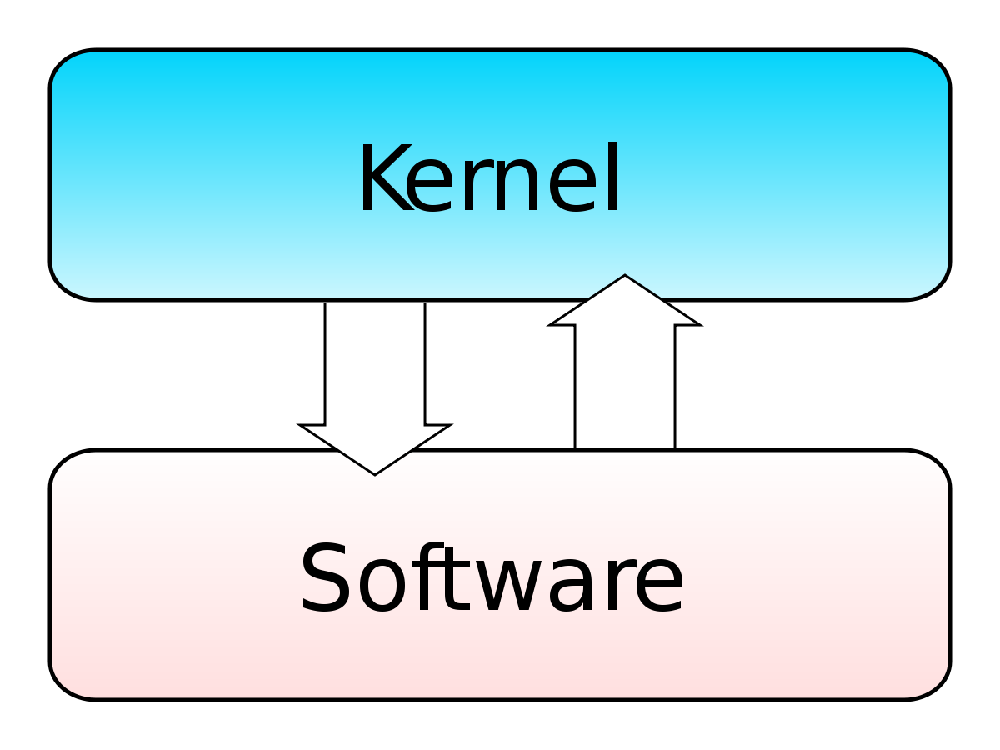
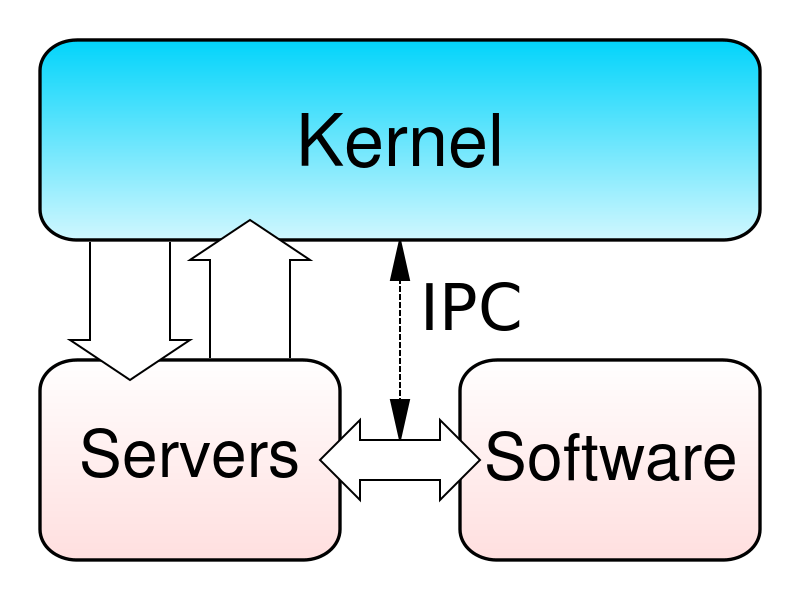
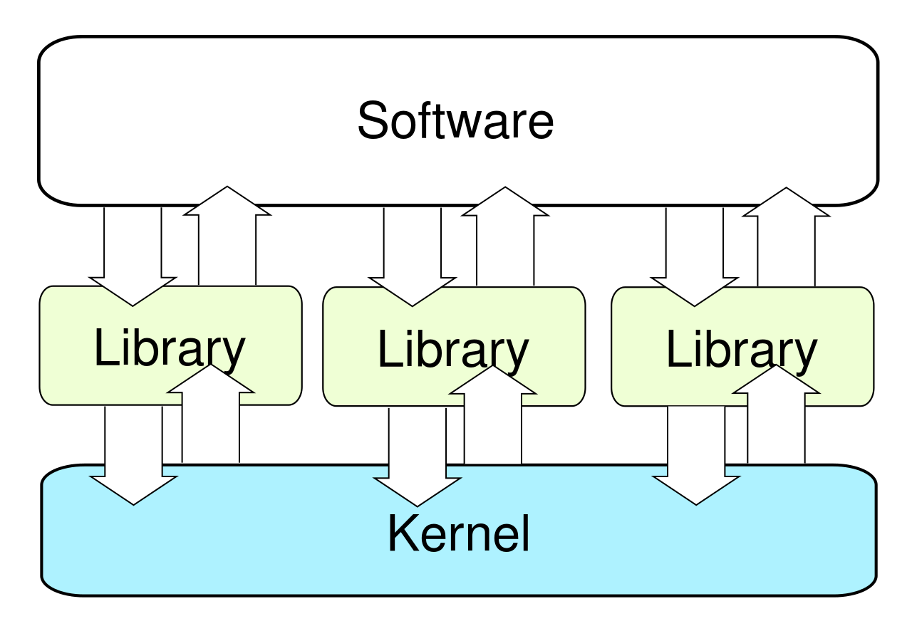
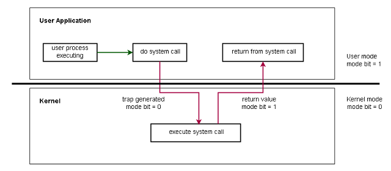
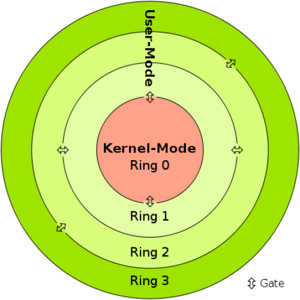

# Actividad 1

## Tipos de Kernel

### Kernel Monolitico

Estos son los tipos de kernel mas simples y comunes. Estos incluyen la funcionalidad para ejecutar el sistema operativo y es compatible con todos los dispositivos conectados. En estos tipos de kernel el sistema operativo y todos los servicios del kernel esta funcionando dentro del mismo espacio de memoria. Esto causa que el tamaño del kernel y sistema operativo sean mayores, pero resulta en una velocidad mayor de ejecucion ya que el kernel y el sistema operativo comparten memoria.

### Microkernel

Los Microkernels son un tipo de kernel más recientes y por lo tanto no tan comunes como los kernels monolíticos. Estos kernels incluyen solo los servicios esenciales para que el sistema operativo funcione. Las funciones del sistema operativo, como los controladores de dispositivos, las pilas de protocolos y los sistemas de archivos, generalmente se eliminan del propio microkernel y, en su lugar, se ejecutan en el espacio del usuario.

Esto da como resultado un kernel más pequeño que es más rápido y usa menos memoria. Aquí, los servicios de usuario y kernel se implementan en dos espacios diferentes de memoria, un espacio de usuario y espacio de kernel separados.

### Kernel Hibrido

Los kernel hibridos son una cobinacion entre los kernel monoliticos y los microkernel. Incluyen más servicios que los microkernels pero menos que los kernels monolíticos. Esto les permite ofrecer algunos de los beneficios de ambos kernel. Toma prestada la velocidad de los kernel monolíticos al almacenar el kernel y el sistema operativo en el misma area de memoria manteniendo la modularidad de los microkernels.

### Nano Kernel

Los nano kernels son el tipo más pequeño de Kernel, que consta de solo unas pocas miles de líneas de código. Significa que el código que se ejecuta en el modo privilegiado del hardware es mínimo. Se utilizan principalmente en sistemas embebidos o dispositivos con recursos limitados.

### Exo Kernel

Este Kernel tiene protección y administración de recursos por separado. Este se utiliza cuando se realiza una personalización específica de la aplicación. Los Exo Kernel están diseñados generalmente para su uso en dispositivos móviles. Son una variación de los micronúcleos que incluyen características adicionales específicas para dispositivos móviles, como administración de energía y soporte para múltiples procesadores.

---

---

## Modo Usuario VS Modo Kernel

El procesador de un equipo cambia entre dos modos en función al tipo de codigo que se ejecutara: el modo usuario y el modo kernel

### Modo Kernel

El kernel es el programa central en el que se basan todos los demas componentes del sistema operativo, se utiliza para acceder a los componentes de hardware y programar que procesos deberan ser ejecutados por el procesador,asi como gestionar las interacciones entre el software y el hardware. Por lo tanto, es el programa con mas privilegios, a diferencia de otros programas, este modo puede interactuar directamente con el hardware.

Cuando los programas que se ejecutan en modo de usuario necesitan acceso al hardware, por ejemplo, una cámara web, primero tiene que pasar por el kernel mediante una llamada al sistema y, para llevar a cabo estas solicitudes, la CPU cambia del modo usuario al modo kernel de manera momentanea durante la ejecucion del proceso y revierte al modo de usuario una vez terminado este.

---

### Modo Usuario

cuando un programa se inicia en un sistema operativo inicia en modo de usuario. Y cuando un programa en modo usuario solicita ejecutarse, el sistema operativo crea un proceso y un espacio de direcciones virtuales (espacio de direcciones para ese proceso). Los programas de modo de usuario tienen menos privilegios que las aplicaciones de modo de kernel y no se les permite acceder a los recursos del sistema directamente. Por ejemplo, si una aplicación en modo de usuario desea acceder a los recursos del sistema, primero deberá pasar por el kernel del sistema operativo mediante llamadas al sistema.

---

### Diferencias

| Modo Kernel                                                                                     | Modo Usuario                                                                     |
| ----------------------------------------------------------------------------------------------- | -------------------------------------------------------------------------------- |
| El programa tiene acceso completo a los recursos del sistema                                    | El programa debe pedir permiso al kernel para acceder a los recursos del sistema |
| Todos los procesos comparten un espacio de direcciones virtuales                                | Cada proceso es separado en espacios de direcciones virtuales separadas          |
| Este modo puede acceder tanto a los programas del usuario como a los programas del kernel       | Solamente puede acceder a programas del programa                                 |
| Puede acceder a la memoria tanto de usuario como la del kernel                                  | Solo puede acceder a la memoria de usuario                                       |
| Un crasheo en este modo puede dañar severa e irreparablemente el sistema operativo o la memoria | Un crasheo en este modo puede ser recuperado simplemente al reiniciar el equipo  |
| Si ocurre una interrupcion del kernel todo el sistema operativo puede llegar a fallar           | Una interrupcion en este modo solo causara el fallo de uno o multiples procesos  |

---
Actividad 1  
Sistemas Operativos 1 - Sección A  
Derek Esquivel Diaz  
202010055 

